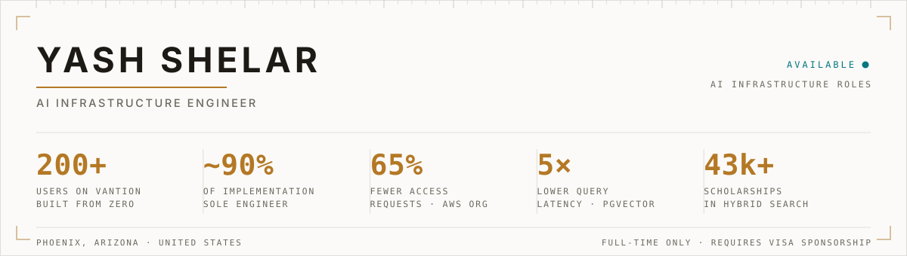
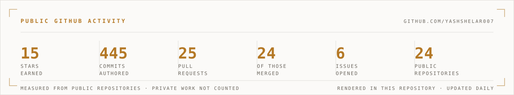
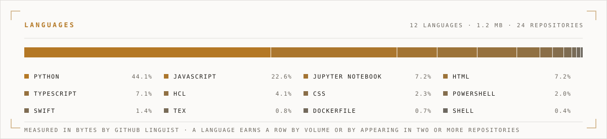

<picture>
  <source media="(prefers-color-scheme: dark)" srcset="assets/header-dark.svg">
  <source media="(prefers-color-scheme: light)" srcset="assets/header-light.svg">
  
</picture>

I build AI infrastructure and the evaluation that tells you whether it works.

Right now that means **Vantion**, Walnutech's product, which I took from zero to `200+` users and wrote `~90%` of across backend, ML, infrastructure, console and frontend. For most of that time I was the only engineer at a company of three. That is the denominator the number needs.

---

## NOW

| | |
| --- | --- |
| **Vantion** | Walnutech's product. Zero to `200+` users, `~90%` of the implementation. Scholarship matching, hybrid search over `43,000+` records, LLM evaluation in production. Closed source. |
| **[pathwise](https://github.com/YashShelar007/pathwise)** | Trajectory evaluation for AI agents. Scores *how* an agent reached an answer, not only the answer, so wrong reasoning, tool misuse, loops and silently recovered errors stop passing. Assertions run across N repeated runs and report a pass-rate distribution, because agents are stochastic and a single boolean hides that. Apache-2.0. |
| **Vera** | Agentic personal assistant, production PWA. Tool use over Postgres full-text search, web search with citations, application tracking and email drafting. Three-tier tool permissions (read, write, act) enforced in one execution path, so anything irreversible or outward-facing needs explicit confirmation. Email is drafted, never sent. Private repo. |

---

## WORK

### Software Development Engineer · Walnutech PBC
`Sep 2025 to now` · full-time since April 2026

- Built **Vantion** from zero to `200+` users and wrote `~90%` of the implementation across backend, ML, infrastructure, console and frontend. Only engineer at a three-person company for most of that time. Two interns have since joined.
- Built LLM evaluation harnesses that run in production: LLM-as-judge with calibrated scoring and regrounding, multi-turn A/B evaluation, a reranker calibration harness. One run takes `20` randomly selected student profiles and produces `800` judgments, which turns output quality into a measurement instead of an opinion.
- Ran model-selection studies that decided production, including Haiku over Sonnet on a measured quality and cost tradeoff rather than on intuition.
- Authored the organization's AI-native engineering toolkit: `15` workflow skills, custom agents and safety hooks distributed to `8` repositories through an internal plugin marketplace, with every repository audited on a 0 to 5 agent-readiness rubric and the rollout briefed to leadership.
- Designed a multi-account AWS organization (dev, test, prod) with IAM Identity Center, SCP guardrails and environment-specific roles. Access requests fell `65%`.
- Replaced a 3GB MindsDB sidecar with a pgvector hybrid search engine over `43,000+` scholarships: average query latency down `5x`, `120s` of bootstrap time gone, `4GB` reclaimed per ECS task. The speed came from deleting the network hop and the boot, not from tuning the search.

<sub>Python, FastAPI, LangChain, LangGraph, Langfuse, pgvector, MCP, Anthropic and OpenAI APIs, Docker, AWS (ECS Fargate, ALB, CloudWatch, IAM Identity Center, Secrets Manager), Terraform, GitHub Actions with OIDC.</sub>

### Software Developer · United Portraits
`Jan 2026 to Mar 2026`

- Built **SMS Manager**, a Twilio messaging platform with batch scheduling, opt-out tracking and quiet-hours enforcement. Twilio compliance went from `78%` to `94%` in four weeks and held at `98.6%` weekly.
- Two months, and I left for AI work specifically, evaluation and model behaviour. The dates overlap Walnutech because they were different commitments: full-time here, a few hours a week there while Walnutech was still an internship.

<sub>Angular 21, TypeScript, Fabric.js, Three.js, RxJS, Spring Boot 4, Java 21, Twilio, Keycloak, PostgreSQL, Docker Compose, Nginx.</sub>

### Cloud and ML Researcher · VISA Research Lab
`Jan 2024 to Aug 2025`

- Built **MCaaS**, a serverless model-compression pipeline on AWS that scaled to `100+` executions per month, cut manual compression effort by `90%` and deployment failures by `42%`.
- Orchestrated distributed workflows on AWS Step Functions: `14x` model size reduction and `3.4x` faster inference at under `4%` accuracy loss.

<sub>Python, PyTorch, Bash, AWS (ECS Fargate, S3, Lambda, Step Functions), Docker, Terraform. Also my master's thesis.</sub>

---

## HOW I WORK

**Review means using the thing.** Every pull request on my team runs automated tests plus a Claude and a Codex review. Bugs still reached production, because reviewers were approving on the strength of reading a diff. Each pull request now raises an ephemeral environment, a container with the database and the frontend, and posts the link into the conversation with a guideline for what to check. The reviewer opens it before approving, and the container is destroyed on merge. Fewer bugs reach production.

**A confident model answer is a starting point, not a conclusion.** On MCaaS I implemented unstructured pruning because an LLM said it would reduce model size. It zeroes weights, it does not remove them, so the file on disk was exactly the same size. I had already taken that result to my professor.

**Ask a model for structure, not for the answer.** Matching student profiles against scholarship eligibility with an LLM directly was bad. The match should stay deterministic, SQL and explicit rules, with the model converting eligibility prose into machine-checkable rules, ontology fields and entity relationships. Structure can be verified. An answer has to be trusted.

---

## STACK

| | |
| --- | --- |
| **Cloud and infrastructure** | AWS (ECS Fargate, Lambda, S3, ALB, DynamoDB, Step Functions, IAM Identity Center), GCP, Azure, Terraform, Pulumi, Docker, Kubernetes, Snowflake |
| **Languages** | Python, Go, TypeScript, JavaScript, SQL, Bash, C, C++, Java |
| **AI and ML** | LangChain, LangGraph, Model Context Protocol, Anthropic API, OpenAI API, RAG, LLM evaluation and LLM-as-judge, pgvector, PyTorch, TensorFlow |
| **Observability and delivery** | Langfuse, CloudWatch, Sentry, GitHub Actions, Vercel, secrets management |
| **Frameworks and data** | FastAPI, Next.js, React, Angular, Flask, Node.js, PostgreSQL, Redis, MongoDB, MySQL, Supabase |

---

## AVAILABILITY

| | |
| --- | --- |
| **Looking for** | Mid-level AI infrastructure roles, SDE 2 or equivalent. One year of full-time experience, so past early career and not presenting as senior. |
| **Employment type** | **Full-time only.** Not available for contract work. |
| **Work authorization** | Authorized to work in the United States and **requires visa sponsorship**. |
| **Location** | Phoenix, Arizona. Open to relocation, no preference between remote, hybrid and onsite. |
| **Timing** | Already in a full-time role, so a move is a considered one rather than an urgent one. I can start early for the right thing. |

---

## EDUCATION

- **MS Computer Science**, Arizona State University, `Aug 2025`. Thesis: Model Compression as a Service for Resource-Constrained Edge Devices.
- **BS Computer Science**, Arizona State University, `Dec 2022`. Summa Cum Laude, New American Scholar, Dean's List.

---

## ACTIVITY

<!--START_SECTION:waka-->

```rust
From: 08 August 2025 - To: 31 August 2026

Total Time: 364 hrs 56 mins

Markdown                   109 hrs 5 mins        >>>>>>>------------------   27.28 %
Python                     73 hrs 56 mins        >>>>>--------------------   18.49 %
TypeScript                 71 hrs 22 mins        >>>>---------------------   17.85 %
Other                      34 hrs 56 mins        >>-----------------------   08.74 %
JavaScript                 22 hrs 43 mins        >------------------------   05.68 %
YAML                       21 hrs 23 mins        >------------------------   05.35 %
Terraform                  11 hrs 33 mins        >------------------------   02.89 %
SQL                        10 hrs 5 mins         >------------------------   02.52 %
JSON                       8 hrs 51 mins         >------------------------   02.22 %
Bash                       8 hrs 43 mins         >------------------------   02.18 %
```

<!--END_SECTION:waka-->

<picture>
  <source media="(prefers-color-scheme: dark)" srcset="assets/stats-dark.svg">
  <source media="(prefers-color-scheme: light)" srcset="assets/stats-light.svg">
  
</picture>

<picture>
  <source media="(prefers-color-scheme: dark)" srcset="assets/languages-dark.svg">
  <source media="(prefers-color-scheme: light)" srcset="assets/languages-light.svg">
  
</picture>

---

## ELSEWHERE

<p>
<a href="https://yashshelar.com"><picture><source media="(prefers-color-scheme: dark)" srcset="assets/link-site-dark.svg"><source media="(prefers-color-scheme: light)" srcset="assets/link-site-light.svg"></picture></a>
<a href="https://linkedin.com/in/shelar-yash"><picture><source media="(prefers-color-scheme: dark)" srcset="assets/link-linkedin-dark.svg"><source media="(prefers-color-scheme: light)" srcset="assets/link-linkedin-light.svg"></picture></a>
<a href="https://yashshelar.com/resume.pdf"><picture><source media="(prefers-color-scheme: dark)" srcset="assets/link-resume-dark.svg"><source media="(prefers-color-scheme: light)" srcset="assets/link-resume-light.svg"></picture></a>
</p>

LinkedIn is the way to reach me.
